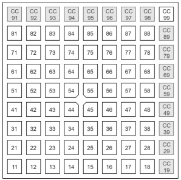

# Launchpad Mini MK3 on NodeJS
This project can interface with the Launchpad Mini MK3, both reading out its buttons as well as control the lights under the buttons.
The code is hardly documented, so if anyone wants to use it but can't figure it out, just send me a message or drop an issue.

The code is based on the programmers reference by Novation. If you google Launchpad Mini MK3 Programmers Reference you should be able to find a pdf-file. That file also

## Colours
These colour codes can be used in the `buttonLights` array in the code to give each button a colour.

## Button numbers
These numbers can be used in the `buttonFunctions` object to give buttons a function.

## Basic functions
The Stop/Solo/Mute button is reserved for turning off the program. Keep it pressed for a second and the script will shutdown gracefully.

### Play sound
Using this function you can play a sound with a button. Create a directory called `sounds` and put your sound-files in there. Currently it relies on the `mplayer` being present on your system for playing the sounds.

### Command
Using this function you can run any command. Be aware, this can potentially do a lot of damage if you run something you don't know. Use it to open programs for example.